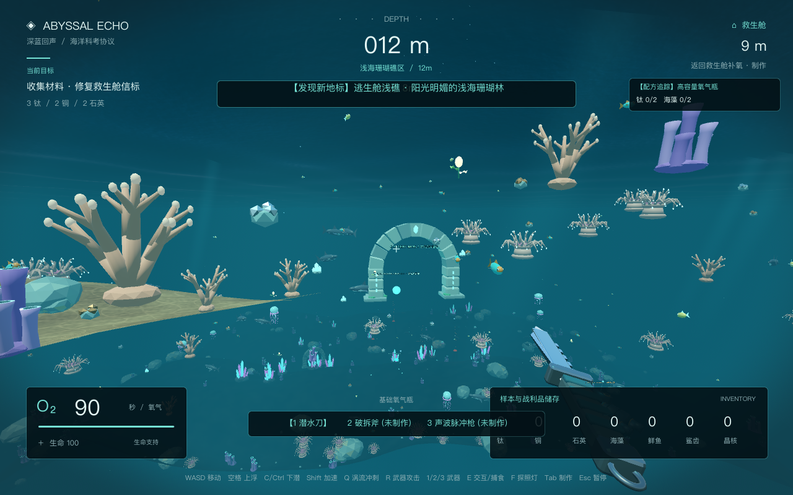
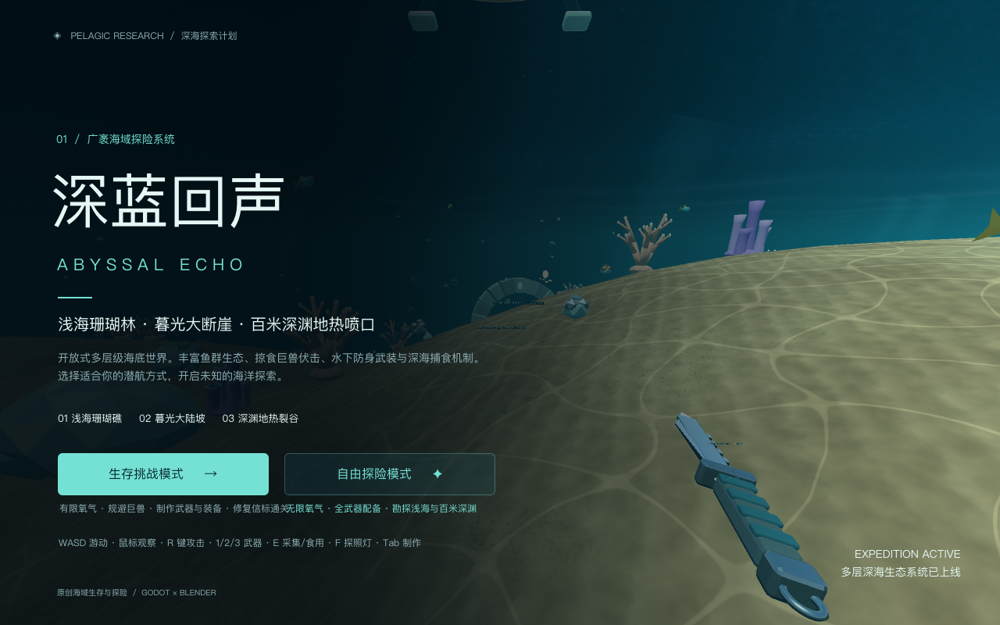
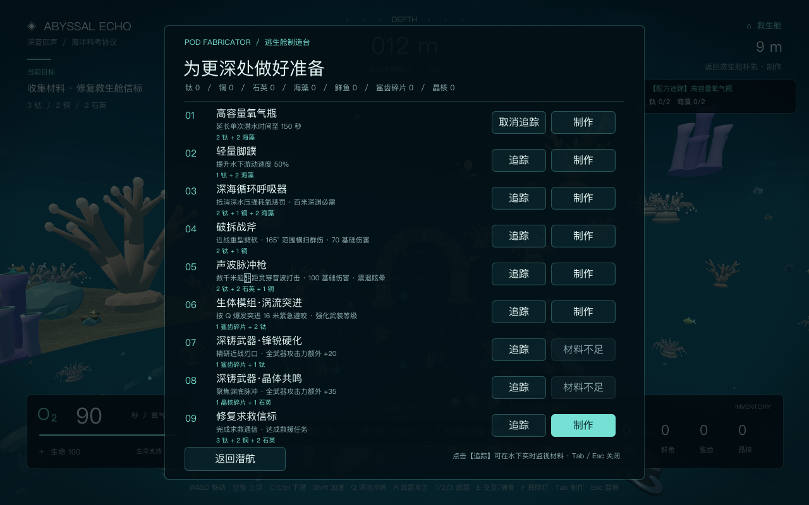
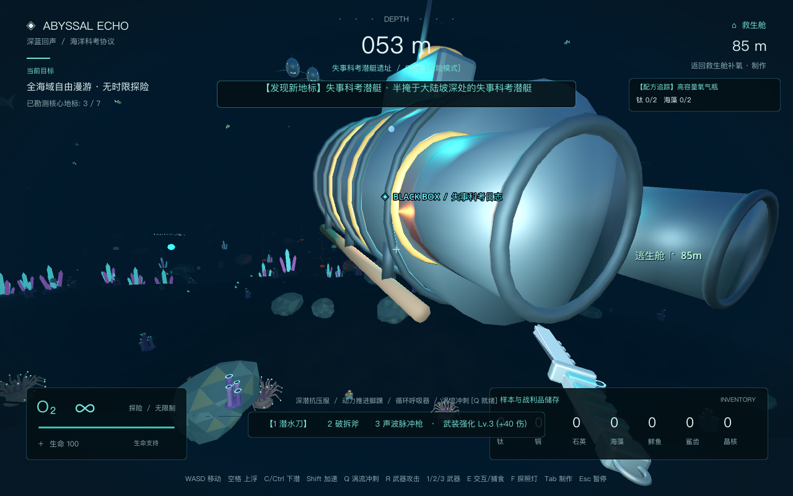
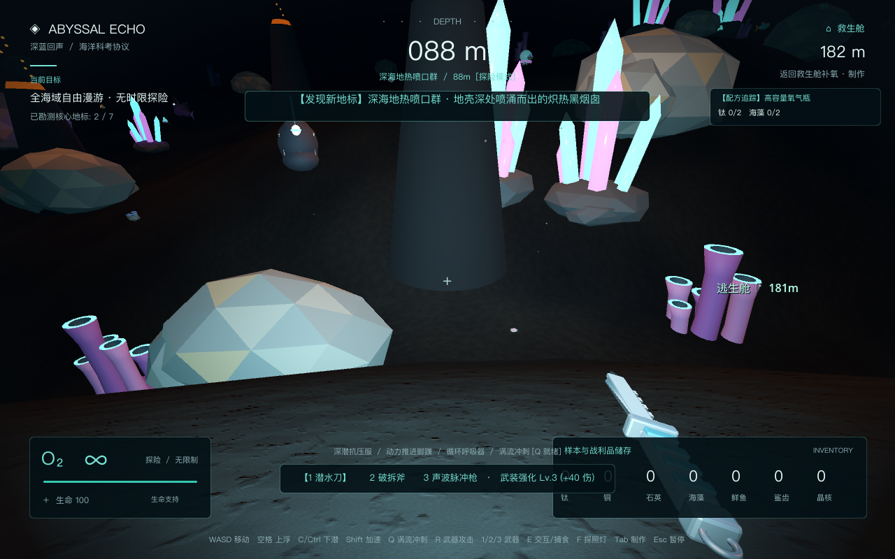

# 深蓝回声 · Abyssal Echo

使用 Blender MCP 制作原创模型、Godot 4.7.2 实现的第一人称海洋生存与探险游戏。下潜至广阔的立体多层海域，从阳光明媚的浅海珊瑚礁漫游至百米幽暗深渊的热液喷口。



| 标题界面 | 逃生舱制造台 | 失事科考潜艇 | 深渊热液喷口 |
| :---: | :---: | :---: | :---: |
|  |  |  |  |

## 最新特性（生态演进与深海武装）

1. **多样化海洋鱼类与庞大鱼群规模**：
   - 鱼类总数量从 18 条扩展至 **134 条自主游动鱼群**，涵盖浅水珊瑚鱼、深海发光小鱼、巡弋暗礁鲨鱼与百米渊底鮟鱇巨兽等 4 大物种。
2. **掠食生物攻击性与生态追猎 AI**：
   - **巡弋暗礁鲨**（浅海/大陆坡 18 条）与**深渊鮟鱇巨兽**（百米深渊 14 条）具有主动侵略性。
   - 当潜水员进入其感知范围时，捕食者会切换至狂暴追猎状态并加速扑咬，撕咬造成 24~40 点生命伤害，伴随屏幕受击红光警示；遭遇致命伤时自动触发应急救生浮力系统。
3. **强力大照射范围体积探照灯**：
   - 战术潜水手电全面升级：光照强度提升至 **9.0**，照射距离延伸至 **85 米**，光束角度扩展至 **55°**，并辅以近身柔和环境补光，清晰穿透幽暗冷寂的深渊与海沟。
4. **多样化深海武装与大幅度多目标打击系统**：
   - **统一攻击键位**：全面升级并统一为 **R 键** 执行武器挥击与射击，彻底释放鼠标观察手感。
   - **大幅度横扫与打击机制诊断升级**：重构以往单一射线细小检测架构，引入广角锥形范围打击。破拆战斧具备 **165° 广角横扫（最大 99 目标）** 与 8.5 米攻击距离，能一次性击退面前整群海兽；潜水刀支持 130° 前方多目标刺击；配合全屏大幅正弦曲线挥砍轨迹、受击镜头冲击震荡（Camera Punch）与实体光弧特效。
   - **潜水战术刀（Knife）**：初始防身武器，快速轻刃刺击（冷却 0.28s，基础伤害 32，支持 3 目标劈刺）。
   - **破拆战斧（Axe）**：重型高能双手战斧，165° 超广角全屏下劈横扫（冷却 0.55s，基础伤害 70，强力击退 16m，横扫前方全部海兽）。
   - **声波脉冲枪（Sonic Rifle）**：百米深渊声学重炮，**基础攻击力提升至 100 点**，攻击范围延伸至 **3000 米（数千米超视距打击）**，具备穿透性声波激波锥，可直线震晕沿途所有掠食者并造成 3.2 秒强力硬直。
   - 具备第一人称武器持握、深海潜泳水流摇摆动态，按 **1 / 2 / 3** 快捷切换，按 **R** 挥击/击发。
5. **大型海兽身体碎片掉落与双轨武器攻击力强化机制**：
   - **实体碎片掉落**：击败巡弋暗礁鲨掉落高亮发光【**巨鲨齿骨碎片**】；击败深渊鮟鱇巨兽掉落幽蓝结晶【**深渊巨兽晶核**】。掉落物具有深海水下自发光信标与浮动旋转效果，极易辨识锁定。
   - **现场生物吸收强化**：准星对准掉落碎片按 **E** 拾取，潜水员外骨骼立即吸收生物活性物质：吸收鲨齿碎片直接提升 **+12 全武器攻击力**，吸收晶核直接提升 **+25 全武器攻击力**，并提升武器强化等级。
   - **逃生舱制造台深铸锻造**：在基地制造台可使用战利品进行深层加工——【锋锐硬化】（1 鲨齿碎片 + 1 钛，永久攻击力额外 +20）、【晶体共鸣】（1 晶核碎片 + 1 石英，永久攻击力额外 +35），双轨叠加打造极强深海武装。
6. **捕食发光小金鱼（野外紧急补给）**：
   - 海底游动着 54 条敏捷的**发光小金鱼**，准星对准按 **E** 即可直接捕抓并生食，立刻恢复 **+25 生命值** 与 **+20 氧气**，为长距离探险提供野外自给自足。

## 游戏模式

游戏支持两种核心玩法模式，可在标题界面自由选择：

1. **生存挑战模式（经典体验）**
   - **资源与氧气管理**：初始 90 秒氧气，深海下潜需时刻注意氧气余量，靠近逃生舱 7 米内或浮出水面补氧，亦可就地捕抓发光小鱼补充氧气与生命。
   - **装备与武装制造**：采集矿物制作高容量氧气瓶（150秒）、动力脚蹼（移速+50%）、破拆战斧及声波脉冲枪抵御掠食海兽。
   - **通关目标**：收集 3 钛 + 2 铜 + 2 石英，在逃生舱制造台修复并激活求救信标完成获救。

2. **自由探险模式（无时限全域漫游）**
   - **无限时自由探索**：无任何时间限制与倒计时，无限氧气、全武器解锁、无死亡风险，可自由在浅海珊瑚林与百米深渊地热裂谷之间终身漫游。
   - **全海域 7 大核心地标勘测**：地标发现通过横幅 Toast 实时播报，探索全部 7 处地标触发勘测大师达成提示，不会强制中断游戏跳转结算画面，玩家可无拘无束尽情深潜。
   - **便携制造**：不受距离限制随时呼出制造台（Tab 键）。

## 地图与生态分层

海域地图从原版的 200m × 200m 大幅扩充至 **500m × 400m**，纵向深度延伸至 **105 米**，包含三个截然不同的地貌与生态层级：

- **浅海珊瑚礁区（深度 0m ~ 20m）**：波光粼粼的水面焦散与日光束，丰富多样的鹿角珊瑚、海藻林、巨型发光海葵，成群游动的发光小金鱼、巡弋暗礁鲨鱼与近岸矿物步道。
- **暮光大陆坡断崖（深度 25m ~ 58m）**：海床急剧倾斜的壮丽断崖，阳光逐渐隐没，光照转为深蓝冷调，半掩于斜坡深处的**失事科考潜艇遗址**、古代海沟遗迹拱门以及漂浮游动的发光水母。
- **深渊海床裂谷与热液喷口（深度 60m ~ 105m）**：永夜般的百米深海峡谷，矗立着 4 座炽热发光的黑烟囱火山地热喷口、发光玄武岩结晶簇柱（水晶石笋群）、史前发光巨石祭坛、游荡的凶猛深渊鮟鱇巨兽与深海发光水母群。全域海底沙质着色器随深度平滑过渡为深色玄武岩深海沉积物。

### 核心地标（探险勘测目标）

1. **逃生舱浅礁**（深度 9m）：逃生舱起点基地，安全的避难所与生命支持站。
2. **古代海沟遗迹**（深度 22m）：半掩埋于浅海与斜坡交界海床的古代巨石拱门。
3. **暮光大断崖**（深度 28m）：由浅海骤降进入深海的大陆坡断层边缘，设有发光导航浮标。
4. **失事科考潜艇**（深度 56m）：半掩埋于暮光大陆坡深处的失事深潜科考船，拥有加固耐压壳体、黄色外骨骼肋骨、反应堆微光与应急信标。
5. **深渊裂谷入口**（深度 68m）：通向百米极深暗黑峡谷的咽喉通道。
6. **深渊史前祭坛**（深度 88m）：沉眠于幽暗渊底的发光巨石遗迹阵列。
7. **深海地热喷口群**（深度 95m）：地壳深处喷涌而出的 4 座黑烟囱火山热泉，伴随滚烫熔岩与上升气柱。

## 开始

Windows 双击 **开始游戏.bat**；macOS 双击 **开始游戏.command**。也可以在 Godot 4 中导入 `project.godot`，按 F6/F5 运行主场景。

```sh
.tools/Godot.app/Contents/MacOS/Godot --path .
```

首次在其他机器打开时，先用 Godot 编辑器导入项目和 GLB 资源。本地引擎不纳入 Git；下载来源见 [引擎说明](docs/runtime-setup.md)。

## 操作与按键

| 操作 | 按键 |
| --- | --- |
| 游泳 / 观察 | WASD / 鼠标 |
| 上浮 / 下潜 | 空格 / Ctrl 或 C |
| 加速冲刺 | Shift（生存模式下略微加快耗氧） |
| 武器攻击 / 射击 | **R**（统一快捷攻击键） |
| 武器切换 | **1** 战术小刀 / **2** 破拆战斧 / **3** 声波脉冲枪 |
| 采集矿物 / 吸收战利品 / 捕食小鱼 | **E**（准星对准 5.5 米内目标） |
| 打开制造台 | **Tab** |
| 战术潜水探照灯 | **F** |
| 暂停 / 返回 | **Esc** |

海床共散布 **100 处发光矿物资源**、**134 条自主演进游动鱼群**（含 54 条可食用小鱼、32 条高威胁掠食者）及 **28 处发光水母生态**。

## 制作与强化配方

| 制作 / 强化 | 材料 | 效果 |
| --- | --- | --- |
| 高容量氧气瓶 | 2 钛 + 2 海藻 | 氧气上限提升至 150 秒（生存模式） |
| 动力脚蹼 | 1 钛 + 2 海藻 | 游泳速度提升 50% |
| 破拆战斧 | 2 钛 + 1 铜 | 解锁重型近战战斧，70 基础伤害，165° 广角横扫前方群兽 |
| 声波脉冲枪 | 2 钛 + 2 石英 + 1 铜 | 解锁 3000 米超远射程声学脉冲火器，100 基础伤害与贯穿眩晕 |
| 深铸武器·锋锐硬化 | 1 鲨齿碎片 + 1 钛 | 研磨近战刃口与弹片，全武器攻击力额外 +20，提升强化等级 |
| 深铸武器·晶体共鸣 | 1 晶核碎片 + 1 石英 | 聚焦渊底声学共鸣腔，全武器攻击力额外 +35，提升强化等级 |
| 求救信标 | 3 钛 + 2 铜 + 2 石英 | 触发深海救援，生存模式获胜 |

## 项目与资产

- `scripts/`：潜水控制器、武器持握与程序化打击系统、生态鱼群与掠食者追猎 AI、生存与探险状态管理、HUD 动态仪表盘、游戏总控。
- `shaders/`：海底深度感知沙质衰减着色器（`sand.gdshader`）、动态海浪表面着色器（`water.gdshader`）、阳光束体积光（`shaft.gdshader`）。
- `assets/models/`：Blender 5.2.1 LTS 导出的 21 个 GLB 资产模型（潜水战术刀、破拆战斧、声波脉冲枪、发光小金鱼、巡弋暗礁鲨、深渊鮟鱇巨兽、逃生舱、失事科考潜艇、古代遗迹拱门、鹿角珊瑚、管状珊瑚、巨型发光海葵、深渊玄武岩水晶柱、发光水母、海藻、海床岩石等）。
- `tools/create_assets.py`：可复现的 Blender 建模与材质导出脚本。
- `assets/audio/`：低多边形潜航环境音效与矿物采集音。
- `docs/`：高质量截图与运行配置指南。

## 自动化测试与验证

```sh
# 1. 生存/探险模式、武器制作、捕食小鱼、伤害计算规则单元测试
.tools/Godot.app/Contents/MacOS/Godot --headless --path . -s tests/smoke.gd

# 2. 真实 3D 物理、134 条鱼群生态、掠食攻击与受创、武器切换与实弹打击、地标发现及通关端到端验证
.tools/Godot.app/Contents/MacOS/Godot --headless --path . -- --smoke-world
```

## 构建与发布

- **Windows 一键打包**：直接双击 `一键打包.bat`，即可在 `build/` 目录下生成包含全部资源的单文件 `深蓝回声.exe`。
- **导出预设**：项目根目录已包含标准 `export_presets.cfg`，可直接配合 Godot 4 导出模板使用。

## 开源协议与声明

### 许可证
本项目基于 [MIT 许可证](LICENSE) 开源。

### 免责与版权声明
1. 本项目为个人/独立开发的海洋探险生存游戏原型，旨在探索 Godot 4 渲染与游戏机制实现。
2. 游戏中部分设计灵感来源于《深海迷航》（Subnautica），《Subnautica》及其商标与知识产权归 Unknown Worlds Entertainment / KRAFTON 所有。本项目与其无任何商业关联或官方合作。
3. 本项目内所有 3D 模型与贴图均由程序化脚本（`tools/create_assets.py`）及 Blender 原创制作。
